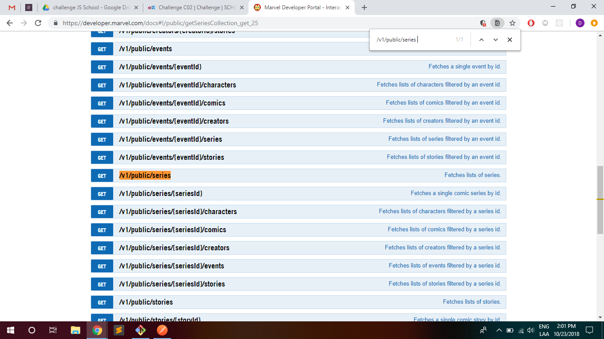
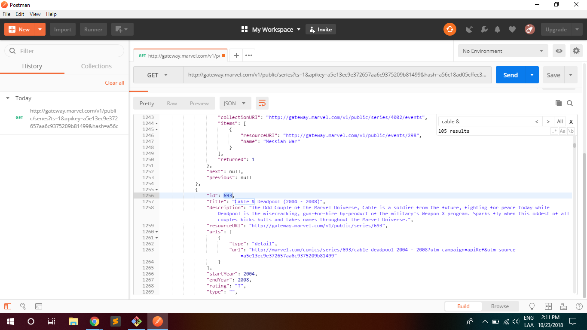
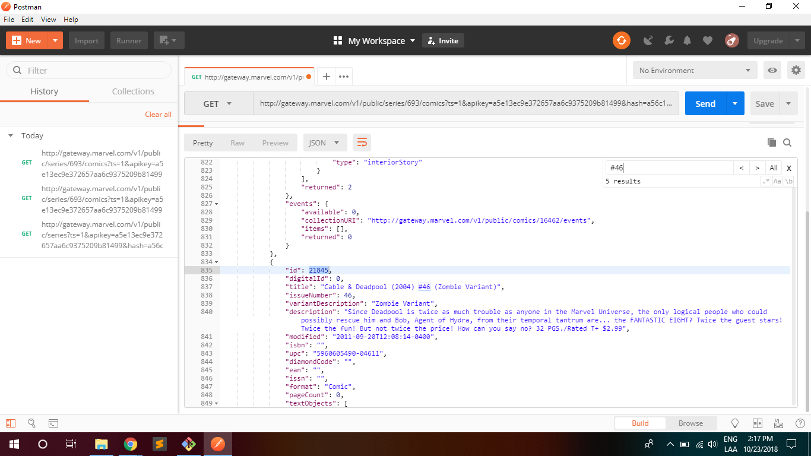
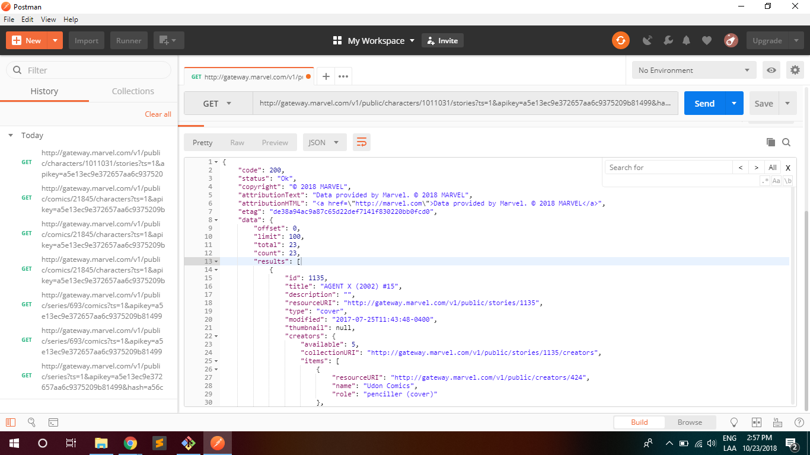

# Challenge C02: RESTful APIs and HTTP requests

In this file you can see a step-by-step of the challenge, consisting in getting JSON info of **the list of characters of Cable & Deadpool (2004) #46 (Zombie Variant)** and **the list of all stories when Agent X (Nijo) appears**, using the MARVEL developer API and Postman.

1. Get into MARVEL documentation and first look for the collection, i.e. **Cable & Deadpool** *series*  .

2. Get the Series ID to search the **#46 (Zombie Variant)** *comic* issue .

3. Finally, use the comic ID to get the *characters of that comic*  (see document characters.json for detailed information of the characters).

4. The first character in the list is, in fact, **Agent X (Nijo)**, so take the ID of the character to look for  the *list off all stories*  (See file nijo.json for detailed information of the stories).

